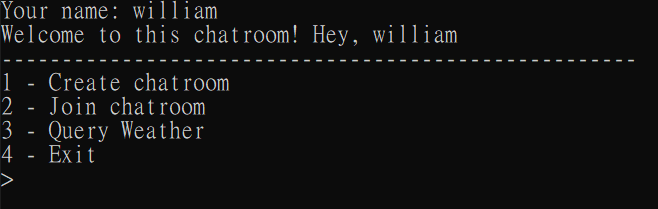
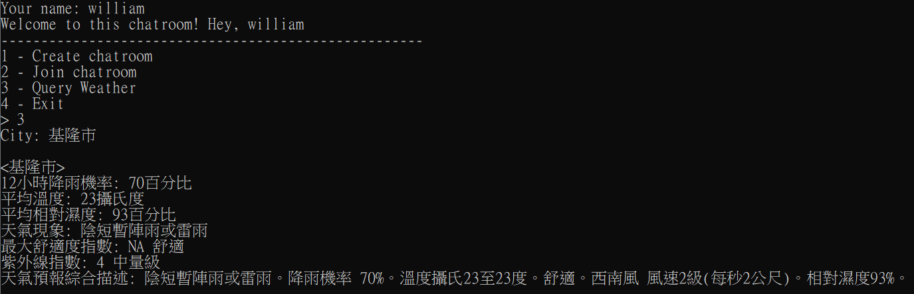

# 
Chat & weather

## Descrpition
---
You can chat with friends in the chatroom or query weather data on the Central Weather Bureau

## How to play
---
### Start
* enter your name to get started
### Chat
* pick a number as roomname to create the room
* use the roomname to join the room
### Query weather

* enter the country in Taiwan to query the real-time weather data
### Quit
* In the chatroom you can use `:q` back to the menu
## About the project
---
language use **Python3**

data transfer use **socket**
